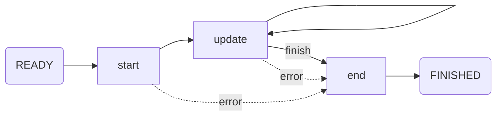

# SSR

Y研の主にTMR用の測定プログラム。

## Core

測定プログラムの本体。

### Lifecycle



### 設定ファイル

設定ファイルはTOML形式で書き、測定データファイルの保存場所、一時ファイルの保存場所、マクロファイルの場所などを指定する。このファイルは各測定毎に用意する。

- `DATADIR`： 測定データファイルの保存するディレクトリへのパス
- `TMPDIR`： 一時ファイルの保存するディレクトリへのパス
- `MACROPATH`： マクロファイルへのパス
- `[MACRO]`テーブル： マクロファイルへの設定を書く

Example

```toml
DATADIR = "path/to/datadir"
TMPDIR  = "path/to/tmpdir"
MACROPATH = "path/to/macropath"

# マクロが自由に設定できる設定
[MACRO]
filename = "foo.csv"
address = 7
```

## Macro

マクロはユーザーが測定に合わせて実装する。具体的には装置との接続・通信、データの保存など。マクロはPythonで書き、`start`、`update`、`end`関数を定義する。

### `start`

測定が始まる前の前処理を書く。例えばデータファイル名、区切り文字、装置との接続、キャリブレーションの設定、など。

- 引数： `StartContext`
  - `StartContext`を通して測定プログラムとやりとりをする。
- 戻り値： `None`

### `StartContext`

測定プログラムとやりとりをする。

- `filename`： 測定データファイルの名前
- `delimiter`： 測定データファイルのデータを区切る文字（デフォルトは拡張子に応じて決まる）
- `macro_config`： 設定ファイルに書かれたマクロ用の設定
- `get_instrument(address: str) -> pyvisa.Resource`
  - アドレスを指定して実験装置とやりとりするためのインスタンスを得る
- `get_gpib_instrument(address: int) -> pyvisa.Resource`
  - `get_instrument`のGPIB用のラッパー
- `set_calibration(key: str, path: str | Path) -> None`
  - キャリブレーションファイルを指定して線形補間関数を作成する
  - 異なる`key`を設定することで複数作成できる
- `write(*data: tuple) -> None`
  - 測定データファイルに書き込む
  - 文字列を除く`iterable`オブジェクトは展開されます
- `resolve_path(path: str | Path) -> Path`
  - 相対パスを定義ファイルのあるディレクトリを基準に絶対パスに変換する

### `update`

一回毎の測定を行う関数。
